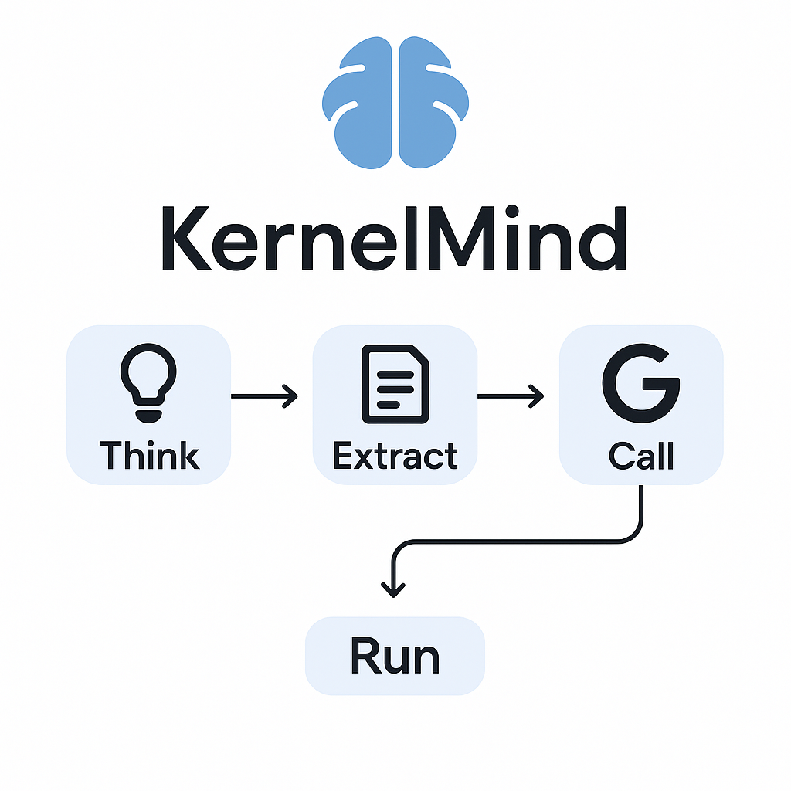

<div align="center">


# 🧠 KernelMind

**From Points to Minds. From Lines to Agents.**

A minimalist thinking kernel for LLM agents — less than 100 lines of core logic to compose AI workflows with Points and Lines.

[GitHub ⭐](https://github.com/zhanj/kernelmind) • [PyPI 📦](https://pypi.org/project/kernelmind) • [Guide 📘](./guide.md)

</div>

---

## 🚀 Why KernelMind?

> KernelMind is a lightweight, extensible and AI-native framework designed for the Agentic Era. With just `Point` and `Line`, you can build:

- ✅ LLM pipelines (with retries, async, fallback)
- ✅ Agent workflows (step-by-step planning & execution)
- ✅ RAG (retrieval-augmented generation)
- ✅ Structured output & YAML parsing
- ✅ Auto-routable workflows (like if/else, maps, branches)

---

## 📦 Quick Install

```bash
pip install kernelmind
```

---

## 🔧 Example: Simple Q&A Agent

```python
from kernelmind.core import Point, Line

class Ask(Point):
    def process(self, _): return input("Ask:")
    def save(self, memory, _, out): memory["q"] = out; return "default"

class Answer(Point):
    def load(self, memory): return memory["q"]
    def process(self, q): return f"Mock answer: {q}"
    def save(self, memory, _, out): print("Answer:", out)

ask, answer = Ask(), Answer()
ask >> answer
Line(entry=ask).run({})
```

---

## 🧠 Concepts

| Concept | Meaning |
|--------|---------|
| `Point` | One atomic task: an LLM call, a transformation, a logic block |
| `Line` | A composition of `Point`s, like a directed graph or sequence |
| `Memory` | A dictionary passed between points, acts as shared context |


---

## 🔁 Conceptual Diagram

A high-level illustration of how Points and Lines work together:



---


## 📚 Docs

- [→ Full Guide](./guide.md)
- [→ GitHub Project](https://github.com/zhanj/kernelmind)
- [→ PyPI Package](https://pypi.org/project/kernelmind)

---

<div align="center">
Made with ❤️ for agent developers
</div>
